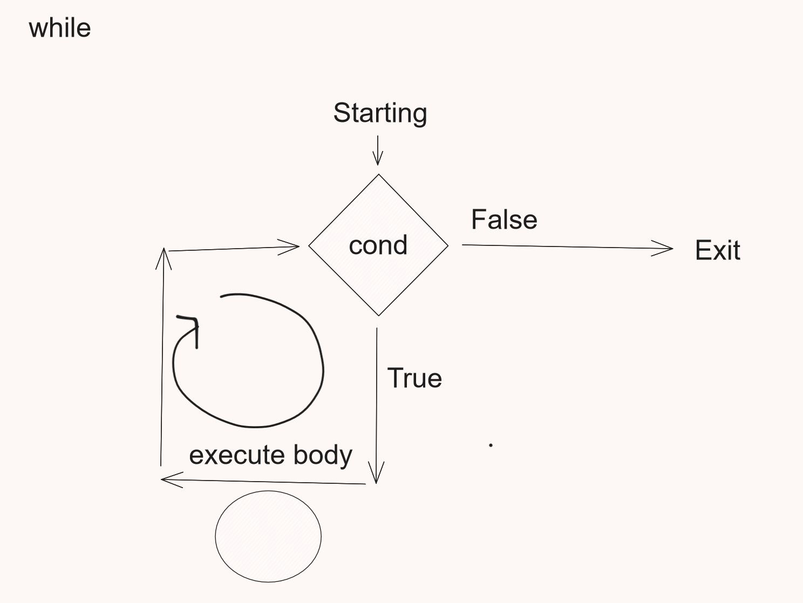
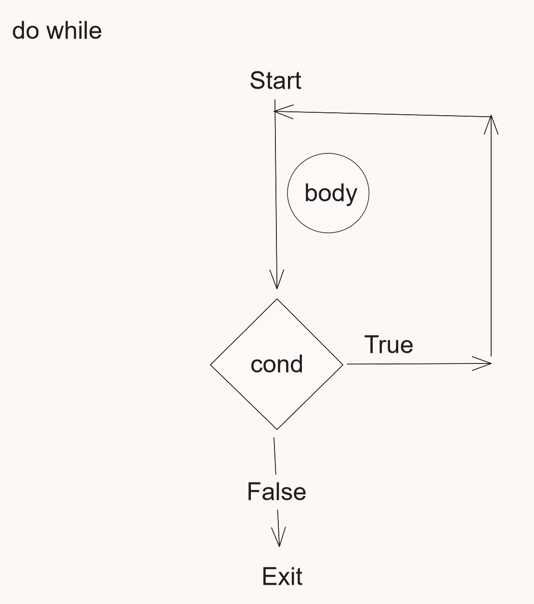

## Control Statments

### if

In Kotlin, if is an expression is which returns a value. It is used for control the flow of program structure. There is various type of if expression in Kotlin.

```kotlin

    if(condation){
    //code statement
    }

    // Syntax of traditional if else statement

    if(condation){
    //code statement
    }
    else{
    //code statement
    }

    // Kotlin if-else Expression

    val returnValue = if (condation) {
    //code statement
    } else {
    // code statement
    }
    println(returnValue)

    //

    // Ladder if example

    val grade: Char = if (marks in 91..100) {
        'A'
    } else if (marks in 81..90) {
        'B'
    } else if (marks in 71..80) {
        'B'
    } else {
        'F'
    }

```

### When Expression

Kotlin, when expression is a conditional expression which returns the value. Kotlin, when expression is replacement of switch statement. Kotlin, when expression works as a switch statement of other language (Java, C++, C).

```kotlin
 val grade: Char = when (marks) {
        in 91..100 -> 'A'
        in 81..90 -> 'B'
        in 71..80 -> {
            println("testing")
            'C'
        }

        else -> {
            'F'
        }
    }


    println("Grade is $grade")

```

### Programms

## Loops

Repeat the statements n number of times

### While



```kotlin
    var count = 1
    while (count <= 10)
    {
        // body statements
        println("durgesh $count")
        count++
    }

    println("Loop exited")

```

### Do..While



```kotlin
    var count = 1
    do {
        println("durgesh $count")
        count++
    } while (count <= 10);
```

### For loop

```kotlin

    for (i in 10 downTo 1) {
        println(i)
    }

    for (i in 0..100 step 3) {
        println(i)
    }

    for (i in 1 ..9) {
        println("i = $i")
    }

     val favActivities: Array<String> = arrayOf("cricket", "chess", "music", "programming")
    for (activity in favActivities.reversed()) {
        println(activity)
    }

```

---

## Operators

Operators are the special symbols used to perform operations.
eg +,-,>..

- Arithmetic Operators

  Perform methametical operations

  | Operator | Example | Explanation      |
  | -------- | ------- | ---------------- |
  | +        | a+b     | add two operands |
  | -        | a-b     | substract        |
  | \*       | a\*b    | multiply         |
  | /        | a/b     | Divide           |
  | %        | a%b     | Modulus          |
  | ++       | a++     | Increment        |
  | --       | a--     | Decrement        |

- Assigment Operators

  Assigns value to variable.

`val a=5;`

where = is assignment operator

**We can use assignment and arthemetic operators togetter** togetter the called **_Arithemetic Assignment Operators_**

| Operator | Example | Expansion | Explanation                             |
| -------- | ------- | --------- | --------------------------------------- |
| +=       | a+=b    | a=a+b     | Add a to b and then assign to a         |
| -=       | a-=b    | a=a-b     | Substract b from a and then assign to a |

etc..

- Comparison Operators

  Compare two values

  | Operator | Example | Explanation        |
  | -------- | ------- | ------------------ |
  | ==       | a==b    | Equal              |
  | <        | a<b     | Less than          |
  | >        | a>b     | Greater than       |
  | <=       | a<=b    | Less than equal    |
  | >=       | a>=b    | Greater than equal |
  | !=       | !=      | Not equal          |

- Logical Operators

  Determain logic between to values

| Operator | Example                    | Explanation                                   |
| -------- | -------------------------- | --------------------------------------------- |
| &&       | condition1 && condition2   | return true if both condition are true        |
| \|\|     | condition1 \|\| condition2 | return true if any of two conditions are true |
| !        | !a                         | reverse the result                            |

## Hard Keywords

- as

  is used for type casts.

  ```kt
    val ob: Any ="Testing"
    val test=ob as String
  ```

  specifies an alias for an import

  ```kotlin
  import java.util.ArrayList as SubstringList
  ```

- in

  specifies the object being iterated in a for loop.

  ```kotlin
  for(i in 1..10)
  {

  }
  ```

  is used as an infix operator to check that a value belongs to a range, a collection, or another entity that defines a 'contains' method.

  ```kotlin
  if(i in  collection)
  {

  }
  ```

is used in when expressions for the same purpose.

marks a type parameter as contravariant.

```kotlin
   interface Demo<in T>
    {
        // T is only consumed never produced
    }
```

- is

  checks that a value has a certain type.

  is used in when expressions for the same purpose.

- typealias

  for type aliasing

  ```kotlin
  typealias DkSet = Set<String>


  ```

  Do read :
  https://kotlinlang.org/docs/keyword-reference.html

### Smart Typecasting( Smart Cast )

Kotlin convert types automatically if itcheck the type with **is** keyword in if condition.

```kotlin

fun test(value: Any) {

    if (value is String) {
        print(value.length)
    } else {
        print(value)
    }

}
```

## Functions in Kotlin

Set of statements written for doing a specific task.

Function has name, return type , parameters and modifiers.

how to define function in kotlin

**fun** keyword is used to defined function in kotlin

```kotlin
fun [functionName] ([parameter]) : [retunType]
{

//body of the  function

return [Value]

}


//example

fun myFun(n1:Int, n2:Int):Int
{
    return n1+n2
}

```

using the functions

Function can be used when we call the function

```kotlin
val result=myFun(2,5)
```

#### Default Argument

```Kotlin
fun myFun(
    b: ByteArray,
    off: Int = 0,
    len: Int = b.size,
) { /*...*/ }
```

#### Name argument

We can use name when calling

```kotlin
myFun(

off=4,
b=arr,
len=45

)
```

### Lambda

Kotlin functions are the first class which means they can be stored in variables , passed as an argument , retured from another functions .

The function that takes another function as parameter or return another function is called Higher order functions.

```kotlin
fun highOrder(value: () -> Unit, intValue: Int): () -> Unit {

    value()

    return value
}

```
